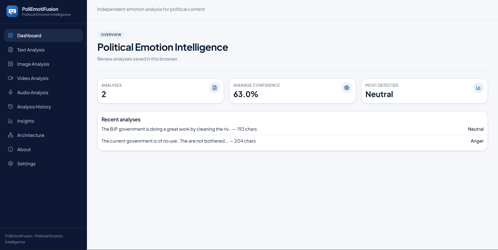
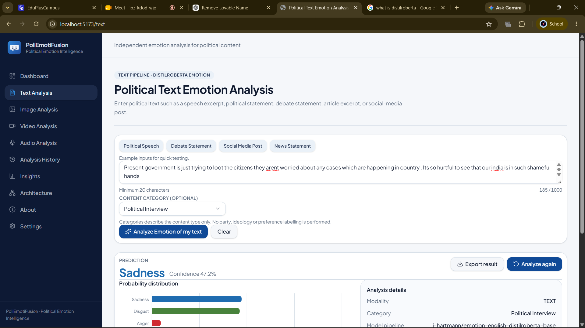
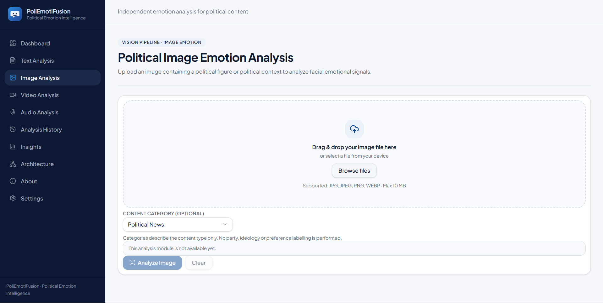
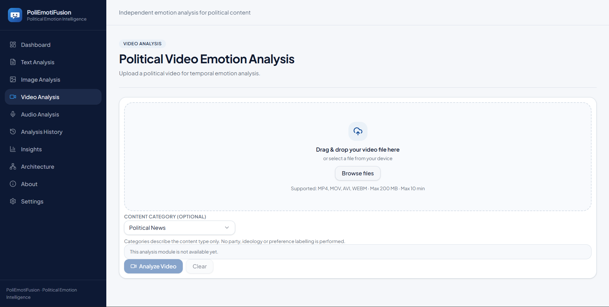
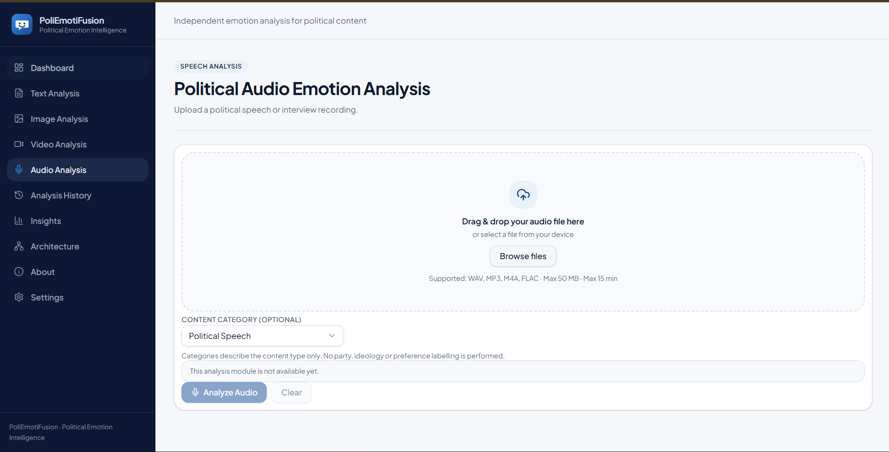
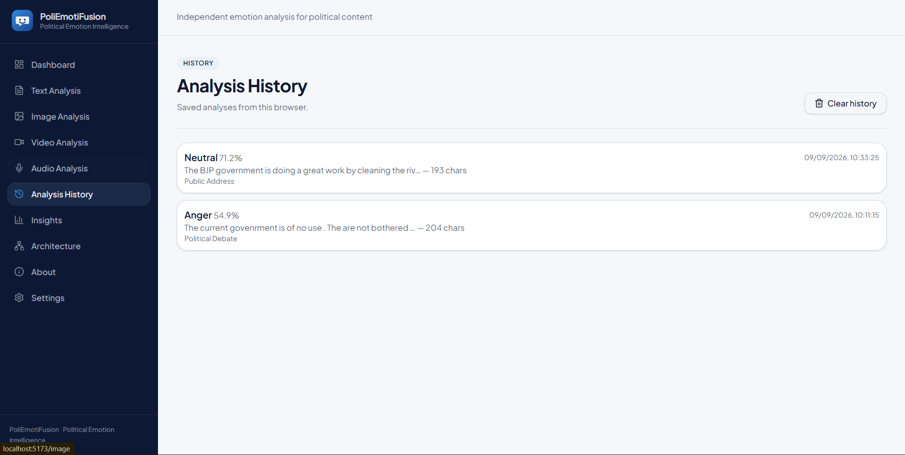
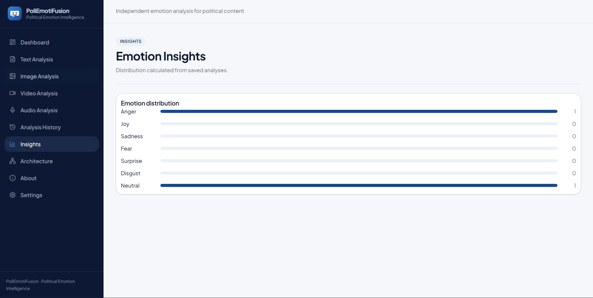

# PoliEmotiFusion

## Multimodal Political Emotion Intelligence

PoliEmotiFusion is a multimodal deep-learning platform designed to analyze emotional signals in political content.

The platform is designed around four major modalities:

- Text
- Image
- Audio
- Video

Currently, the **Text Emotion Analysis** module is fully implemented using a FastAPI backend and a pretrained DistilRoBERTa emotion-classification model. The remaining modalities are integrated into the frontend and are planned for further development.

---

## Overview

Political communication occurs through speeches, debates, news statements, social-media posts, images, audio recordings, and videos. PoliEmotiFusion aims to provide a unified platform for analyzing the emotional characteristics of such content.

The current text-analysis pipeline classifies content into seven emotion categories:

- Anger
- Joy
- Sadness
- Fear
- Surprise
- Disgust
- Neutral

---

## Application Interface

The following screenshots demonstrate the major components of the PoliEmotiFusion platform.

### 1. Dashboard

The Dashboard provides an overview of the PoliEmotiFusion system and gives users access to the different analysis modules available in the platform.

---

### 2. Text Emotion Analysis

The Text Analysis module allows users to enter political speeches, debate statements, news statements, or social-media posts. The submitted text is processed by the backend and analyzed using the DistilRoBERTa emotion-classification model.

---

### 3. Image Analysis

The Image Analysis module provides an interface for uploading political images and analyzing their emotional characteristics. The frontend interface is currently available, while the complete image-analysis pipeline is planned for a future development stage.

---

### 4. Video Analysis

The Video Analysis module allows users to upload political video content for analysis. It is designed as part of the multimodal architecture and will support video-based emotional analysis in future development stages.

---

### 5. Audio Analysis

The Audio Analysis module provides an interface for uploading political audio recordings. It is intended to analyze emotional signals from speech and other audio-based political content.

---

### 6. Analysis History

The Analysis History section is designed to maintain and display previously performed analyses, allowing users to review their earlier results.

---

### 7. Insights & Visualizations

The Insights section is designed to present analyzed results through visual summaries and visualizations, helping users understand emotion distributions and identify patterns across analyzed political content.

---
